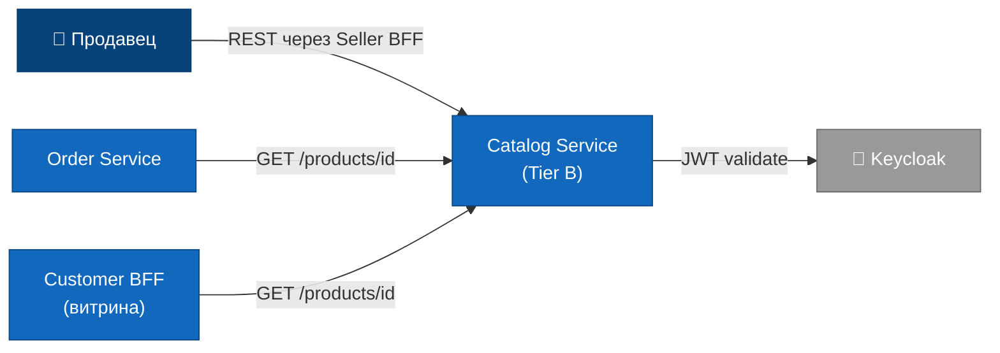
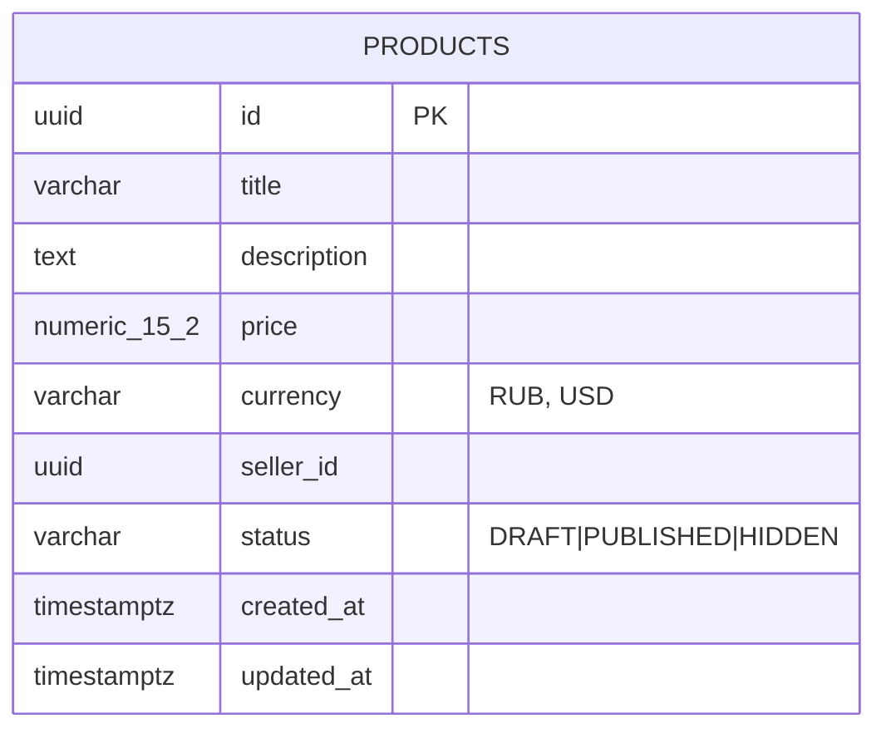

# Catalog Service — Use Case спецификация (Tier B)

Эта спека — **средний** по сложности артефакт между [Order Service (Tier C)](/case/order-service/) и [Notification Service (Tier A)](/case/notification-service/). Tier B значит: подключаем библиотеку [`usecase-pattern`](/use-case-pattern/library/), вводим записи `UseCase` + `UseCaseHandler` с CQRS-маркерами, но **не вводим агрегаты, доменные события, саги, hexagonal-разделение** — это уровень C.

Catalog в нашем маркетплейс-кейсе делает один минимальный набор операций: продавец заводит карточку товара, публикует, скрывает. Order Service берёт у Catalog цену по `productId` для оформления заказа. Всё — никаких категорий, поиска, фото, остатков, отзывов — это уровень witrine'ы (Customer BFF), а не Catalog'а ответственность.

Полный код — [github.com/remodov/catalog](https://github.com/remodov/catalog), машинно-читаемая копия спеки в `docs/spec/`.

## Содержание

1. [Контекст / модуль](#1-контекст--модуль)
2. [Ubiquitous Language](#2-ubiquitous-language)
3. [Domain Model](#3-domain-model)
4. [Жизненный цикл продукта](#4-жизненный-цикл-продукта)
5. [Роли и права](#5-роли-и-права)
6. [Бизнес-правила](#6-бизнес-правила)
7. [Commands (UseCase)](#7-commands-usecase)
8. [Queries](#8-queries)
9. [Use Cases](#9-use-cases)
10. [UI-спецификация](#10-ui-спецификация)
11. [Каталог ошибок](#11-каталог-ошибок)
12. [Интеграции](#12-интеграции)
13. [Критерии приёмки](#13-критерии-приёмки)
14. [Нефункциональные требования](#14-нефункциональные-требования)
15. [Стек технологий](#15-стек-технологий)


## 1. Контекст / модуль

**Сервис: «Catalog»**

На Tier B термин «Bounded Context» уже уместен — Catalog **владеет** концептом «Product», знает его жизненный цикл, никто другой не может изменить статус продукта. Но это не Tier C: внутри нет агрегата, нет доменных событий, нет саг.

### Отвечает за

- Создание/публикация/скрытие карточек товаров.
- Контроль перехода `DRAFT → PUBLISHED ↔ HIDDEN` через UseCase'ы.
- Хранение базовых атрибутов: title, description, price, seller_id, status.
- Sync REST API для Order Service: «дай цену по `productId`».
- Личный кабинет продавца: «мои продукты».

### Не отвечает за

- **Витрину покупателя** — публичный листинг, поиск, категории, фото, отзывы. Это уровень Customer BFF / отдельного storefront-сервиса.
- **Категории** — добавление их в Catalog затёрло бы границу с витриной. Tier B не вводит того, что не нужно для работы кейса.
- **Остатки/склад** — это Inventory Service. Catalog не показывает количество.
- **Загрузку фото и хранение файлов** — отдельный Media Service.
- **Поиск/фильтрацию** — на Tier B простые SQL-запросы без full-text. Поиск по тексту — отдельная история (Elasticsearch / OpenSearch).
- **Аутентификацию** — IdP (Keycloak).

### Соседние системы

| Сосед | Направление | Как |
|---|---|---|
| Order Service | inbound REST | `GET /api/v1/products/{id}` — даёт цену для расчёта заказа |
| Customer BFF / Seller BFF | inbound REST | `POST /api/v1/products`, `POST /api/v1/products/{id}/publish` и т.д. |
| Keycloak | outbound (token validation) | OAuth2 Resource Server, JWT с `realm_access.roles` |

Catalog **не публикует** доменных событий и **не подписывается** на чужие — никакого Kafka-топика для него не нужно.

### Стейкхолдеры

- **Владелец**: команда «Каталог».
- **Зависят от нас**: Order Service (берёт цену), Seller BFF (управление карточками), Customer BFF/витрина (читает PUBLISHED).
- **От кого зависим**: только IdP.

### Диаграмма C1




## 2. Ubiquitous Language

| Термин | Определение |
|---|---|
| **Product** | Карточка товара конкретного продавца. Один и тот же iPhone у двух продавцов — это **два разных Product** (как в общем кейсе). Никакого «склеивания SKU». |
| **Seller** | Продавец маркетплейса. У продукта ровно один owner-seller. |
| **Status** | Состояние карточки: `DRAFT`, `PUBLISHED`, `HIDDEN`. Перевод между состояниями — отдельный UseCase. |
| **UseCase** | Бизнес-операция как `record`, реализующая `UseCaseCommand<R>` или `UseCaseQuery<R>`. См. [методологию](/use-case-pattern/library/). |
| **UseCaseHandler** | Spring-bean `@Component` с `@Transactional`, выполняет операцию. Логика — здесь, не в `record`. |

Намеренно **нет**:
- **Aggregate / Value Object / Domain Event / Saga** — это Tier C, в Catalog избыточно.
- **Category** — нет такого понятия в первой версии (см. контекст).


## 3. Domain Model

На Tier B раздел сводится к ER + UseCase-моделям ввода/вывода (request/response DTO). Доменных классов вне `UseCase` нет.

### ER-схема



Одна таблица — `products`. На Tier C тут появились бы Value Object `Money(amount, currency)`, агрегат `Product` с invariant'ами и т.п. На Tier B это лишнее: цена и валюта — два поля строки БД, `BigDecimal` + `String` достаточно.

### UseCase-модели

Для команд вход — `record`, реализующий `UseCaseCommand<Product>`. Например:

```java
public record CreateProductUseCase(
    SellerId sellerId,
    String title,
    String description,
    BigDecimal price,
    String currency
) implements UseCaseCommand<Product> {
    public CreateProductUseCase {
        Objects.requireNonNull(sellerId, "sellerId");
        if (title == null || title.isBlank()) throw new IllegalArgumentException("title");
        if (price == null || price.signum() <= 0) throw new IllegalArgumentException("price > 0");
    }
}
```

Валидация — в compact-конструкторе. Никакого `@Valid` поверх контроллера; валидация привязана к `UseCase`-у, а не к транспорту. Это и есть смысл UCP Level 2.

`SellerId` — wrapper-record вокруг `UUID`, чтобы compiler не давал перепутать с `ProductId`. Минимальная типизация без полноценного DDD.

`Product` (возвращаемое значение) — это просто generated `ProductsPojo` от jOOQ. Никакого handcrafted класса.


## 4. Жизненный цикл продукта

```mermaid
stateDiagram-v2
    [*] --> DRAFT: CreateProduct
    DRAFT --> PUBLISHED: PublishProduct
    PUBLISHED --> HIDDEN: HideProduct
    HIDDEN --> PUBLISHED: PublishProduct
    DRAFT --> [*]: (никаких прямых удалений; терминал — отдельный UC если понадобится)
    PUBLISHED --> [*]
    HIDDEN --> [*]
```



Три состояния, два перехода:

- `DRAFT` — продавец только что создал карточку, не видна Order Service'у и витрине.
- `PUBLISHED` — карточка опубликована: Order Service видит цену через `GET /products/{id}`, витрина показывает её покупателям.
- `HIDDEN` — продавец временно скрыл (сезонный товар, ремонт, поломка). Из `HIDDEN` можно снова опубликовать.

Удаление/архив **не делаем** на старте — нет требования. Если понадобится — добавится отдельный `ArchiveProductUseCase`, terminal-статус `ARCHIVED`. Tier B позволяет это без рефакторинга предыдущих UseCase'ов.

На Tier C переход в state machine был бы методом агрегата: `product.publish()`. На Tier B это просто проверка в handler'е — `if (status != DRAFT && status != HIDDEN) throw ...`. Логика та же; разница в том, **где она живёт**.


## 5. Роли и права

| Роль (JWT) | Что может |
|---|---|
| `seller` | Создавать продукты от своего имени; публиковать/скрывать **только свои**; видеть **только свои** через `ListMyProducts`; читать любой PUBLISHED через `GET /products/{id}` |
| `admin` | Всё, что seller, для любого продавца |
| (без auth) | `GET /products/{id}` для PUBLISHED — публичный read. Service-to-service: Order Service использует JWT с `service-account` ролью |

ABAC на уровне UseCase-handler'а: достаём `requesterSellerId` из JWT (`sub`), сравниваем с `product.sellerId`. Если не совпадает — `OWN_PRODUCT_REQUIRED` (404 для скрытия чужих).


## 6. Бизнес-правила

`BR-C1` **Цена обязательна, > 0.** Создать продукт с `price <= 0` нельзя. Валидация в `record`-constructor'е `CreateProductUseCase`.

`BR-C2` **Валюта** — на старте только `RUB` (общий принцип кейса «только Россия и рубли»). Технически поле open для расширения, но валидация enforce'ит RUB.

`BR-C3` **Уникальность ID** — гарантируется генерацией UUID на сервере (никогда не принимаем `id` от клиента).

`BR-C4` **Только владелец публикует/скрывает.** Если seller_id из JWT ≠ product.seller_id → `OWN_PRODUCT_REQUIRED`. Admin перебивает это правило.

`BR-C5` **Допустимые переходы статусов.** `Publish`: только из `DRAFT|HIDDEN`. `Hide`: только из `PUBLISHED`. Иначе → `INVALID_STATE_TRANSITION`.

`BR-C6` **`GET /products/{id}` отдаёт только `PUBLISHED`.** На `DRAFT|HIDDEN` — 404, чтобы Order Service случайно не использовал черновик. (Внутренний read для seller-кабинета — по `ListMyProducts` отдаёт всё своё, любые статусы.)


## 7. Commands (UseCase)

Все команды реализуют `UseCaseCommand<Product>`. Возвращают актуальный `Product` (jOOQ-generated POJO).

| UseCase | Кто | Из какого статуса | Что делает |
|---|---|---|---|
| `CreateProductUseCase` | seller | — | создаёт `DRAFT` от имени `requesterSellerId` |
| `PublishProductUseCase` | seller | `DRAFT \| HIDDEN` | переводит в `PUBLISHED` |
| `HideProductUseCase` | seller | `PUBLISHED` | переводит в `HIDDEN` |

Контроллер — простой dispatch:

```java
@PostMapping("/api/v1/products")
@PreAuthorize("hasRole('seller')")
public ResponseEntity<ProductDto> create(@RequestBody CreateProductRequest req) {
    var sellerId = authenticatedSeller.currentSellerId();
    var useCase = new CreateProductUseCase(sellerId, req.title(), req.description(),
                                              req.price(), req.currency());
    var product = useCaseDispatcher.dispatch(useCase);
    return ResponseEntity.status(CREATED).body(mapper.toDto(product));
}
```

Никакой бизнес-логики в контроллере — только маппинг и ABAC через `@PreAuthorize`.


## 8. Queries

`UseCaseQuery<R>` — read-only с `@Transactional(readOnly = true)`.

| Query | Кто | Параметры | Результат |
|---|---|---|---|
| `GetProductQuery` | publicly via Order Service / витрина / seller / admin | `productId` | `Product` если `PUBLISHED` (для seller/admin — любой свой) |
| `ListMyProductsQuery` | seller | `requesterSellerId`, `status?`, `page`, `size` | страница продуктов продавца |

Read Model — на Tier B нет: всё читается напрямую из таблицы `products`. Появление отдельной materialized view (для метрик / витрины) — это уже Tier B+ территория.


## 9. Use Cases

### UC-C1: Продавец заводит и публикует продукт

1. Продавец открывает «Добавить товар» в Seller BFF, заполняет форму.
2. BFF делает `POST /api/v1/products` с JWT.
3. Catalog'овский handler создаёт строку `DRAFT` с автогенерённым UUID.
4. Возвращает 201 с телом `ProductDto` (status=DRAFT).
5. Продавец проверяет превью, нажимает «Опубликовать».
6. BFF делает `POST /api/v1/products/{id}/publish`.
7. Handler проверяет: `seller_id` из JWT совпадает с `product.seller_id` (BR-C4), статус `DRAFT|HIDDEN` (BR-C5).
8. UPDATE статус на `PUBLISHED`. Возвращает 200.

### UC-C2: Order Service берёт цену для оформления заказа

1. Покупатель оформляет заказ в Order Service.
2. Order Service вызывает `GET /api/v1/products/{id}` для каждого товара (см. `CatalogRestClient` в order-service).
3. Catalog отдаёт `{id, title, price, currency}` если статус `PUBLISHED`, иначе 404.
4. Order Service использует цену для расчёта заказа.

### UC-C3: Продавец временно скрывает продукт

1. Продавец видит «Скрыть» в кабинете.
2. BFF делает `POST /api/v1/products/{id}/hide`.
3. Handler: ABAC проверка, статус должен быть `PUBLISHED`.
4. UPDATE статус на `HIDDEN`.
5. Order Service теперь возвращает 404 на этот продукт. Витрина перестаёт показывать.

### UC-C4: Чужой продавец пытается изменить чужой продукт

1. Seller-А делает `POST /api/v1/products/{B-id}/publish`.
2. Handler находит продукт, проверяет: `seller_id != A's sellerId from JWT`.
3. Бросает `OwnProductRequiredException` → 404. Намеренно скрываем существование чужих продуктов.


## 10. UI-спецификация

Tier B обычно работает за двумя BFF'ами (Seller BFF для продавца, Customer BFF для витрины). Сам Catalog UI не показывает.

### Экран «Мои продукты» (Seller BFF) — что нужно от Catalog

- `GET /api/v1/products/my?status=&page=&size=` → `ProductSummaryPage`
- `POST /api/v1/products` (форма создания)
- `POST /api/v1/products/{id}/publish`
- `POST /api/v1/products/{id}/hide`

### Витрина (Customer BFF) — что нужно от Catalog

- `GET /api/v1/products/{id}` (показ карточки)
- Листинг публичных PUBLISHED товаров — **не отвечает Catalog**, это agg/cache на стороне Customer BFF (Tier B+ или отдельный сервис).


## 11. Каталог ошибок

[RFC 9457 ProblemDetails](/rest-api-style-guide/07-errors/), `application/problem+json`.

| `code` | HTTP | Когда |
|---|---|---|
| `PRODUCT_NOT_FOUND` | 404 | продукт не существует / `DRAFT|HIDDEN` для публичного `GET /products/{id}` |
| `OWN_PRODUCT_REQUIRED` | 404 | seller пытается изменить чужой продукт (404, не 403, чтобы не светить существование) |
| `INVALID_STATE_TRANSITION` | 409 | `Publish` на уже `PUBLISHED`, `Hide` на `HIDDEN` и т.п. |
| `INVALID_PRICE` | 400 | `price <= 0` (валидация в `record`-constructor) |
| `INVALID_CURRENCY` | 400 | currency не RUB |


## 12. Интеграции

### Inbound REST

| Метод | Путь | Кто | UseCase |
|---|---|---|---|
| `POST` | `/api/v1/products` | seller | `CreateProductUseCase` |
| `POST` | `/api/v1/products/{id}/publish` | seller | `PublishProductUseCase` |
| `POST` | `/api/v1/products/{id}/hide` | seller | `HideProductUseCase` |
| `GET` | `/api/v1/products/{id}` | публичный + seller | `GetProductQuery` |
| `GET` | `/api/v1/products/my` | seller | `ListMyProductsQuery` |

### Outbound: только IdP

Catalog никуда не ходит, кроме Keycloak (token validation, lazy fetch JWK).

### Никаких Kafka

Catalog не публикует и не подписывается. Это сознательное ограничение Tier B: добавление событий вытащит за собой Outbox, idempotent-консьюмеры, schema-registry — это уже Tier C территория.


## 13. Критерии приёмки

| AC | Описание |
|---|---|
| AC-C1 | `POST /products` от seller'а создаёт продукт `DRAFT` с автогенерённым UUID. |
| AC-C2 | `POST /products/{id}/publish` переводит `DRAFT|HIDDEN → PUBLISHED`. |
| AC-C3 | `POST /products/{id}/hide` переводит `PUBLISHED → HIDDEN`. |
| AC-C4 | Чужой seller получает 404 (`OWN_PRODUCT_REQUIRED`) на любую команду. |
| AC-C5 | Невалидный transition (`Publish` уже `PUBLISHED`) → 409 (`INVALID_STATE_TRANSITION`). |
| AC-C6 | `price <= 0` или null → 400 (`INVALID_PRICE`), валидация в `record`-constructor. |
| AC-C7 | `GET /products/{id}` возвращает 200 для `PUBLISHED`, 404 для `DRAFT|HIDDEN`. |
| AC-C8 | `GET /products/my` возвращает только продукты текущего seller'а с пагинацией. |
| AC-C9 | Order Service'овский интеграционный smoke-test (`fetchOne` per `productId`) работает против реального Catalog. |


## 14. Нефункциональные требования

### Производительность

- `GET /products/{id}` — p95 ≤ **50 ms** (один SELECT по PK). Это критично, потому что Order Service дёргает его в цикле при оформлении заказа.
- `POST /products/{id}/publish` — p95 ≤ **100 ms** (SELECT + UPDATE в одной транзакции).
- Нагрузка: 100 RPS на read (Order Service + витрина), 5 RPS на write (продавцы добавляют/публикуют).

### Безопасность

- JWT валидируется через OAuth2 Resource Server (Keycloak JWK).
- ABAC внутри handler'а — `seller_id` сравнение, чтобы продавцы не видели и не меняли чужое.
- Никаких PII (Catalog не хранит email/phone/etc).
- HTTPS обязателен в production (TLS termination на ingress).

### Наблюдаемость

- Метрики: `catalog_create_total{status}`, `catalog_status_transition_total{from, to}`, `catalog_get_latency_seconds`.
- Логи: `productId`, `sellerId`, `requestId` в каждой строке.
- Tracing — OpenTelemetry, span'ы на каждый UseCase.

### Эксплуатация

- Liquibase обновления — без рестарта, дополнительные миграции в `v-1.x/`.
- Один экземпляр держит нагрузку запуска. Горизонтальное масштабирование — за reverse-proxy, без шардирования (jOOQ stateless).


## 15. Стек технологий

```
Java 21
Spring Boot 3.4.x
Spring Web                     — REST для команд и query
Spring Security                — OAuth2 Resource Server (JWT)
spring-boot-starter-jooq       — слой доступа к БД
PostgreSQL 16                  — products
Liquibase                      — схема и сидинг
nu.studer.jooq 10.x            — кодогенерация POJO/Records/Tables/Enums
ru.vikulinva:usecase-pattern   — UseCase / UseCaseHandler / UseCaseDispatcher
Resilience4j                   — circuit breaker (только для возможных future outbound вызовов)
Micrometer + Prometheus        — метрики
OpenTelemetry                  — distributed tracing
JUnit 5 + Testcontainers       — интеграционные тесты с реальным Postgres
```

### Persistence — `BS-17/18`: только jOOQ + только generated классы

Командный стандарт: persistence во всех сервисах **только jOOQ**, независимо от Tier'а. Используем сгенерённые `ProductsPojo`, generated enum `ProductStatus` (если будем Postgres ENUM type) — никаких handcrafted POJO/enum, дублирующих БД. Это ровно те же правила, что и в [order-service (Tier C)](/case/order-service/) и [notification-service (Tier A)](/case/notification-service/).

### `usecase-pattern` library — что даёт на Tier B

```
UseCase<R>            — маркер
UseCaseCommand<R>     — command-маркер (extends UseCase<R>)
UseCaseQuery<R>       — query-маркер (extends UseCase<R>)
UseCaseHandler<UC, R> — обработчик: dispatch ⇒ handle(useCase)
UseCaseDispatcher     — Spring-bean, ищет правильный handler по UseCase-классу
```

Реализация — `record` для UseCase, `@Component` для handler'а, `@Transactional` тоже на handler'е. Никакой магии, никаких аннотаций сверху. Подробнее — [методология](/use-case-pattern/library/) и [уровни зрелости 1-2](/use-case-pattern/level-2/).

### Что не делаем (это уже Tier C)

- **Aggregate root** `Product` с `publish()/hide()`-методами — на Tier B всё в handler'е.
- **Domain events** `ProductPublished`, `ProductHidden` — Catalog не источник событий.
- **Outbox** — нечего публиковать.
- **Saga / Process Manager** — нет распределённых транзакций.
- **Hexagonal core/adapter** — single-module Spring Boot.
- **Categories / search / photos / reviews / stock** — за рамками минимального scope (см. §1).

---

Машинно-читаемая копия — в [github.com/remodov/catalog/docs/spec/](https://github.com/remodov/catalog) вместе с кодом. Каждый раздел — отдельный `.md` с YAML-фронтматтером для скриптов C4 / coverage.
