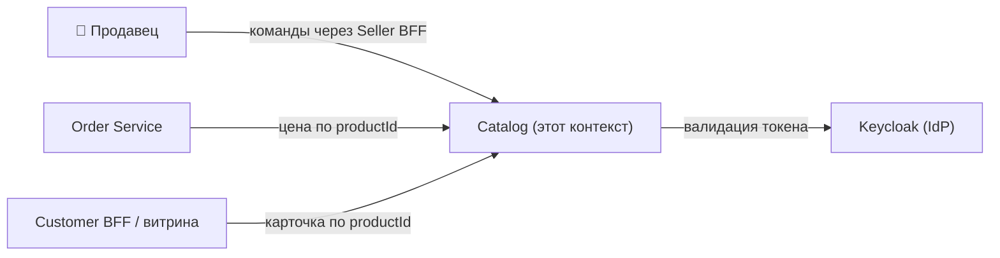
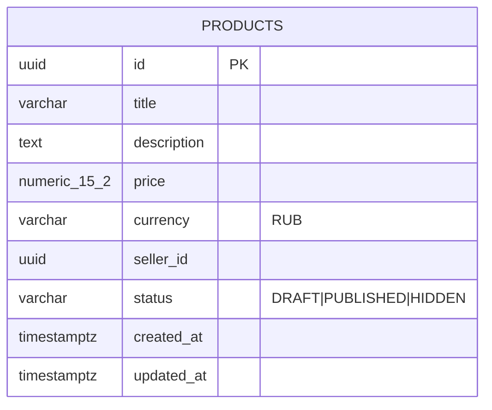
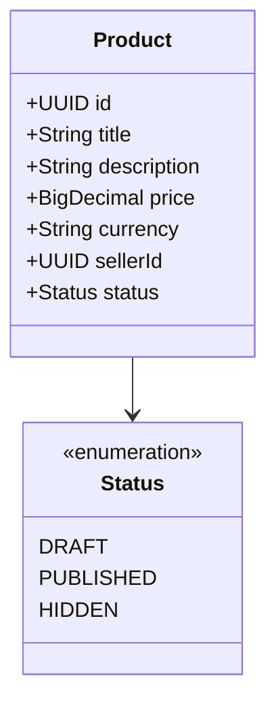
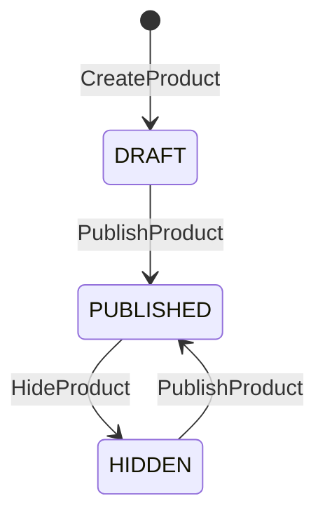

# Catalog Service — Use Case спецификация (Tier B)

Контекст **Catalog** маркетплейс-кейса: продавец заводит карточку товара, публикует, скрывает; Order Service берёт цену по `productId` для оформления заказа. Tier B (UCP Level 1–2): `usecase-pattern` (UseCase + Handler с CQRS-маркерами), без DDD-агрегатов, доменных событий, саг и hexagonal-разделения. Один агрегат-концепт — Product, поэтому спека — единый файл (секции контекста 1–11, секции агрегата 12–18 сквозной нумерацией).

## 1. Bounded Context

**Контекст:** Catalog. **Субдомен:** Supporting — обслуживает основной flow заказа (Order Service) и витрину, но сам не несёт ядровую сложность маркетплейса. **Владелец:** команда «Каталог». **Миссия:** быть единственным владельцем концепта Product и его жизненного цикла — никто, кроме Catalog, не меняет статус продукта.

### Агрегаты

| Агрегат | Назначение | Секции |
|---|---|---|
| Product | Карточка товара продавца со статусом `DRAFT → PUBLISHED ↔ HIDDEN` | [Доменная модель](#12-доменная-модель)…[Запросы](#18-запросы) |

### В границе контекста

- Создание / публикация / скрытие карточек товаров.
- Контроль перехода `DRAFT → PUBLISHED ↔ HIDDEN`.
- Хранение базовых атрибутов: title, description, price, currency, seller, status.
- Синхронная выдача цены по `productId` (для Order Service).
- Личный кабинет продавца: «мои продукты».

### Вне границы

- **Витрина покупателя** — публичный листинг, поиск, категории, фото, отзывы (Customer BFF / storefront).
- **Категории** — затёрли бы границу с витриной; в скоупе кейса не нужны.
- **Остатки / склад** — Inventory Service; Catalog не показывает количество.
- **Фото и файлы** — Media Service.
- **Поиск / фильтрация по тексту** — отдельная история (Elasticsearch / OpenSearch).
- **Аутентификация** — IdP (Keycloak).

### Стыки с соседями

| Сосед | Тип связи | Суть |
|---|---|---|
| Order Service | customer-supplier (Catalog — supplier) | читает цену опубликованного товара |
| Seller BFF / Customer BFF | customer-supplier (Catalog — supplier) | команды продавца + чтение карточки |
| Keycloak | conformist | Catalog принимает контракт токена как есть |

### Стейкхолдеры

- **Зависят от Catalog:** Order Service (цена), Seller BFF (управление карточками), Customer BFF / витрина (читает PUBLISHED).
- **Catalog зависит от:** только IdP (Keycloak).

## 2. Интеграции (Context Map)

| Ребро | Направление | Канал | Связь | Контракт |
|---|---|---|---|---|
| Order Service → Catalog | inbound | sync | customer-supplier (ohs) | [`catalog.openapi.yaml`](../../src/main/resources/openapi/catalog.openapi.yaml) |
| Seller/Customer BFF → Catalog | inbound | sync | customer-supplier (ohs) | [`catalog.openapi.yaml`](../../src/main/resources/openapi/catalog.openapi.yaml) |
| Catalog → Keycloak | outbound | sync | conformist | OIDC / JWKS (контракт IdP) |

### Контракты

- REST (входящий, владелец — Catalog): `src/main/resources/openapi/catalog.openapi.yaml`.
- Async: **нет**. Catalog не публикует доменных событий и не подписывается — Kafka-топиков нет (см. [Доменные события](#5-доменные-события)).

## 3. Ubiquitous Language

| Термин | Определение |
|---|---|
| **Product** | Карточка товара конкретного продавца. Один и тот же iPhone у двух продавцов — **два разных Product**; склейки SKU нет. |
| **Seller** | Продавец маркетплейса. У продукта ровно один owner-seller. |
| **Status** | Состояние карточки: `DRAFT`, `PUBLISHED`, `HIDDEN`. Перевод между состояниями — отдельная команда. |
| **Опубликованный товар** | Product в статусе `PUBLISHED` — единственное состояние, видимое Order Service и витрине. |

**Не путать / намеренно нет:**
- **Category** — понятия категории в контексте нет (см. [границы](#1-bounded-context)).
- **Aggregate / Value Object / Domain Event / Saga** — это Tier C; в Catalog избыточно (доменная модель плоская).

## 4. Роли и доступ

| Роль | Кто это |
|---|---|
| `seller` | Продавец; работает только со своими продуктами. |
| `admin` | Администратор; те же операции, что у seller, но для любого продавца (перебивает ABAC по владельцу). |
| `public` (без auth) | Анонимный читатель — только чтение опубликованной карточки. |
| `service-account` | Сервис-к-сервису (Order Service) — чтение опубликованной карточки по машинному токену. |

**Общий ABAC:** идентификатор продавца берётся из токена (claim `sub`) и сравнивается с владельцем продукта. Несовпадение на изменяющих операциях — отказ как «не найдено» (не раскрываем существование чужого продукта). `admin` обходит проверку владельца. Доступ по операциям — в матрице [Доступ](#14-доступ) агрегата Product.

**PII:** Catalog не хранит персональные данные (email/телефон/адрес отсутствуют) — только бизнес-атрибуты товара и идентификатор продавца.

## 5. Доменные события

**Не применимо на Tier B.** Catalog не публикует доменных событий и не подписывается на чужие. Введение событий потянуло бы Outbox, идемпотентных консьюмеров и schema-registry — это Tier C. Изменения статуса наблюдаются соседями синхронно через REST.

## 6. Use Cases

### UC-C1 — Продавец заводит и публикует продукт

**Актор:** seller. **Агрегаты:** Product.

**Основной поток:**
1. Продавец заполняет форму товара в Seller BFF.
2. Выполняется [CreateProduct](#16-команды) — создаётся карточка в `DRAFT` от имени текущего продавца, с серверным идентификатором.
3. Продавец проверяет превью и инициирует публикацию.
4. Выполняется [PublishProduct](#16-команды) — проверка владельца и допустимого перехода, статус → `PUBLISHED`.

**Альтернативы:** цена ≤ 0 или валюта ≠ RUB на шаге 2 — отказ (см. [BR-P01](#15-бизнес-правила)/[BR-P02](#15-бизнес-правила)); публикация чужого продукта — отказ «не найдено» (см. [BR-P04](#15-бизнес-правила)).

### UC-C2 — Order Service берёт цену для оформления заказа

**Актор:** service-account (Order Service). **Агрегаты:** Product.

**Основной поток:**
1. Покупатель оформляет заказ в Order Service.
2. Order Service для каждого товара выполняет [GetProduct](#18-запросы).
3. Catalog отдаёт цену и атрибуты, если товар `PUBLISHED`.
4. Order Service использует цену для расчёта заказа.

**Альтернативы:** товар в `DRAFT`/`HIDDEN` или не существует — «не найдено» (см. [BR-P06](#15-бизнес-правила)), Order Service не использует черновик.

### UC-C3 — Продавец временно скрывает продукт

**Актор:** seller. **Агрегаты:** Product.

**Основной поток:**
1. Продавец инициирует скрытие в кабинете.
2. Выполняется [HideProduct](#16-команды) — проверка владельца, статус `PUBLISHED` → `HIDDEN`.
3. Order Service и витрина перестают видеть товар (теперь «не найдено» для публичного чтения).

**Альтернативы:** скрытие не из `PUBLISHED` — отказ (недопустимый переход, [BR-P05](#15-бизнес-правила)).

### UC-C4 — Чужой продавец пытается изменить чужой продукт

**Актор:** seller (не владелец). **Агрегаты:** Product.

**Основной поток:**
1. Продавец A инициирует публикацию/скрытие продукта продавца B.
2. Проверка владельца не проходит ([BR-P04](#15-бизнес-правила)).
3. Отказ «не найдено» — существование чужого продукта намеренно не раскрывается.

## 7. Процессы

**Не применимо на Tier B.** Кросс-агрегатных процессов и распределённых транзакций нет (один агрегат, нет саг). Каждая команда — одна локальная транзакция.

## 8. UI-спецификация

Catalog собственного UI не показывает — работает за Seller BFF (кабинет продавца) и Customer BFF (витрина).

### Бейджи статуса (кабинет продавца)

| Статус | Бейдж | Смысл для пользователя |
|---|---|---|
| `DRAFT` | «Черновик» | создан, не виден покупателям и заказам |
| `PUBLISHED` | «Опубликован» | виден витрине и доступен для заказа |
| `HIDDEN` | «Скрыт» | временно снят с витрины, можно опубликовать снова |

### Тексты ошибок для пользователя

| Ситуация | Текст |
|---|---|
| Товар не найден / чужой / не опубликован | «Товар не найден». |
| Недопустимый переход статуса | «Действие недоступно в текущем статусе товара». |
| Некорректная цена | «Цена должна быть больше нуля». |
| Неподдерживаемая валюта | «Поддерживается только рубль (RUB)». |

### Что нужно витрине

- Показ карточки опубликованного товара по идентификатору.
- Публичный листинг PUBLISHED — **не ответственность Catalog** (агрегация/кэш на стороне Customer BFF).

## 9. Критерии приёмки

| AC | Given / When / Then |
|---|---|
| AC-C1 | **Given** продавец; **When** создаёт товар; **Then** карточка в `DRAFT` с серверным идентификатором. |
| AC-C2 | **Given** товар в `DRAFT` или `HIDDEN` владельца; **When** публикует; **Then** статус `PUBLISHED`. |
| AC-C3 | **Given** товар в `PUBLISHED` владельца; **When** скрывает; **Then** статус `HIDDEN`. |
| AC-C4 | **Given** чужой товар; **When** продавец-не-владелец публикует/скрывает; **Then** отказ «не найдено». |
| AC-C5 | **Given** товар уже `PUBLISHED`; **When** публикуют повторно (или скрывают не из `PUBLISHED`); **Then** отказ «недопустимый переход». |
| AC-C6 | **Given** запрос на создание; **When** цена ≤ 0 или null; **Then** отказ «некорректная цена». |
| AC-C7 | **Given** товар; **When** публичное чтение по id; **Then** данные при `PUBLISHED`, иначе «не найдено» при `DRAFT`/`HIDDEN`. |
| AC-C8 | **Given** продавец; **When** запрашивает «мои товары»; **Then** только свои товары (любых статусов) с пагинацией. |
| AC-C9 | **Given** реальный Catalog; **When** Order Service запрашивает цену по `productId`; **Then** интеграционный smoke-тест зелёный. |

## 10. Нефункциональные требования

| Атрибут | Цель |
|---|---|
| Производительность (чтение) | `GetProduct` p95 ≤ 50 ms (один поиск по ключу); критично — Order Service дёргает в цикле при оформлении. |
| Производительность (запись) | публикация p95 ≤ 100 ms (чтение + обновление в одной транзакции). |
| Капасити | ~100 RPS на чтение (Order Service + витрина), ~5 RPS на запись (продавцы). |
| Доступность | сервис stateless, горизонтально масштабируется за reverse-proxy, без шардирования. |
| Согласованность | строгая в пределах одной транзакции команды; межсервисная согласованность — read-time (соседи читают актуальный статус синхронно). |
| Безопасность | JWT (OAuth2 Resource Server); ABAC по владельцу внутри обработки; PII нет; HTTPS обязателен в проде (TLS на ingress). |
| Наблюдаемость | метрики создания и переходов статусов, латентность чтения; `productId`/`sellerId`/`requestId` в логах; распределённый трейсинг по операциям. |
| Эксплуатация | миграции схемы накатываются без рестарта (добавочные версии); запуск одного экземпляра держит стартовую нагрузку. |

## 11. Техническая реализация

Единственный технический раздел; всё выше — домен.

### Контейнеры (C2)

Один развёртываемый контейнер — Spring Boot приложение Catalog; внешнее состояние — PostgreSQL; внешняя зависимость — Keycloak (JWKS).

### Слой → стек → реализация

| Слой | Стек | Реализация |
|---|---|---|
| Платформа | Java 21, Spring Boot 3.4.x | single-module, без hexagonal-разделения |
| REST | Spring Web | контроллеры реализуют операции OpenAPI; маппинг DTO ↔ UseCase; ABAC через `@PreAuthorize` |
| Безопасность | Spring Security, OAuth2 Resource Server | валидация JWT по JWK Keycloak; роли из `realm_access.roles`; профиль `local`/`integration-test` — `permitAll` |
| Бизнес-операции | `ru.vikulinva:usecase-pattern` | `UseCase`/`UseCaseCommand`/`UseCaseQuery` (record) + `UseCaseHandler` (`@Component`, `@Transactional`) + `UseCaseDispatcher`; валидация входа — в compact-конструкторе record |
| Persistence | spring-boot-starter-jooq, nu.studer.jooq 10.x | **только jOOQ и только generated-классы** (`ProductsPojo`, generated enum) — никаких handcrafted POJO/enum (BS-17/18) |
| БД | PostgreSQL 16, Liquibase | схема и сидинг через Liquibase (`migrations/db/changelog/v-X.Y/`) |
| Ошибки | RFC 9457 ProblemDetails (`application/problem+json`) | `@RestControllerAdvice` маппит доменные исключения в коды/HTTP (таблица ниже) |
| Наблюдаемость | Micrometer + Prometheus, OpenTelemetry | метрики и span'ы на операции |
| Тесты | JUnit 5 + Testcontainers | интеграционные тесты против реального Postgres |

**Резилиенс:** Resilience4j подключён под возможные будущие outbound-вызовы; в текущем скоупе Catalog никуда не ходит, кроме IdP.

### Коды ошибок → HTTP

| `code` | HTTP | Когда |
|---|---|---|
| `PRODUCT_NOT_FOUND` | 404 | продукт не существует / `DRAFT`\|`HIDDEN` при публичном чтении |
| `OWN_PRODUCT_REQUIRED` | 404 | изменение чужого продукта (404, не 403 — не раскрываем существование) |
| `INVALID_STATE_TRANSITION` | 409 | публикация уже `PUBLISHED`, скрытие не из `PUBLISHED` и т.п. |
| `INVALID_PRICE` | 400 | `price ≤ 0` (валидация в конструкторе команды) |
| `INVALID_CURRENCY` | 400 | валюта ≠ RUB |

### Схема БД

Одна таблица `products`. Индекс по `seller_id` (для «мои товары»); чтение по `id` — по первичному ключу. Цена и валюта — два поля строки (`BigDecimal` + `String`); Value Object `Money` не вводится (Tier B).

---

# Агрегат Product

## 12. Доменная модель

**Агрегат-корень:** Product — карточка товара продавца. Плоская модель (Tier B): отдельных сущностей и Value Object'ов нет, состояние — атрибуты карточки. Хранение — см. [Схема БД](#11-техническая-реализация).

| Атрибут | Смысл |
|---|---|
| id | идентификатор товара (генерируется сервером) |
| title | название |
| description | описание |
| price | цена (> 0) |
| currency | валюта (RUB) |
| seller_id | владелец-продавец (логическая ссылка на Seller, без FK) |
| status | `DRAFT` \| `PUBLISHED` \| `HIDDEN` |
| created_at / updated_at | технические отметки времени |

Инварианты, защищающие модель (полностью — в [Бизнес-правилах](#15-бизнес-правила)): цена > 0; валюта = RUB; идентификатор всегда серверный.

## 13. Жизненный цикл

| Статус | Смысл |
|---|---|
| `DRAFT` | создан продавцом, не виден Order Service и витрине |
| `PUBLISHED` | опубликован: виден витрине, доступен для заказа |
| `HIDDEN` | временно скрыт продавцом; можно опубликовать снова |

| Из | В | Триггер |
|---|---|---|
| (нет) | `DRAFT` | команда [CreateProduct](#16-команды) |
| `DRAFT` | `PUBLISHED` | команда [PublishProduct](#16-команды) |
| `HIDDEN` | `PUBLISHED` | команда [PublishProduct](#16-команды) |
| `PUBLISHED` | `HIDDEN` | команда [HideProduct](#16-команды) |

Удаление/архив не предусмотрены (нет требования); при необходимости добавится отдельная команда и терминальный статус без переработки существующих.

## 14. Доступ

| Операция | seller (владелец) | admin | public | service-account |
|---|---|---|---|---|
| CreateProduct | ✅ (от своего имени) | ✅ | — | — |
| PublishProduct | ✅ только свой | ✅ любой | — | — |
| HideProduct | ✅ только свой | ✅ любой | — | — |
| GetProduct | ✅ (свой любой статус) | ✅ | ✅ только `PUBLISHED` | ✅ только `PUBLISHED` |
| ListMyProducts | ✅ только свои | ✅ | — | — |

**ABAC по операциям:** изменяющие команды (Publish/Hide) и `ListMyProducts` ограничены владельцем (`seller_id` из токена); `admin` обходит ограничение владельца. `GetProduct` для не-владельца/анонима/сервиса отдаёт только `PUBLISHED`.

## 15. Бизнес-правила

| Код | Тип | Правило | Команда | Ошибка |
|---|---|---|---|---|
| BR-P01 | инвариант | Цена обязательна и > 0 | CreateProduct | `INVALID_PRICE` |
| BR-P02 | инвариант | Валюта — только RUB | CreateProduct | `INVALID_CURRENCY` |
| BR-P03 | инвариант | Идентификатор всегда генерируется сервером (id от клиента не принимается) | CreateProduct | — |
| BR-P04 | предусловие | Публиковать/скрывать может только владелец; `admin` перебивает | PublishProduct, HideProduct | `OWN_PRODUCT_REQUIRED` |
| BR-P05 | предусловие | Допустимые переходы: Publish из `DRAFT`\|`HIDDEN`; Hide из `PUBLISHED` | PublishProduct, HideProduct | `INVALID_STATE_TRANSITION` |
| BR-P06 | предусловие | Публичное чтение по id отдаёт только `PUBLISHED`; `DRAFT`\|`HIDDEN` — «не найдено» | GetProduct | `PRODUCT_NOT_FOUND` |

## 16. Команды

### CreateProduct

- **Переход:** (нет) → `DRAFT`
- **Вход:** seller_id (из токена), title, description, price, currency
- **Предусловия:** цена > 0 ([BR-P01](#15-бизнес-правила)); валюта RUB ([BR-P02](#15-бизнес-правила))
- **Логика:** сгенерировать серверный идентификатор ([BR-P03](#15-бизнес-правила)); сохранить карточку в `DRAFT` от имени текущего продавца; вернуть актуальный продукт
- **Эмитит:** —
- **Ошибки:** `INVALID_PRICE`, `INVALID_CURRENCY`

### PublishProduct

- **Переход:** `DRAFT`\|`HIDDEN` → `PUBLISHED`
- **Вход:** product_id, seller_id (из токена)
- **Предусловия:** продукт существует; запрашивающий — владелец или `admin` ([BR-P04](#15-бизнес-правила)); текущий статус `DRAFT` или `HIDDEN` ([BR-P05](#15-бизнес-правила))
- **Логика:** проверить владельца и статус; перевести в `PUBLISHED`; вернуть актуальный продукт
- **Эмитит:** —
- **Ошибки:** `PRODUCT_NOT_FOUND`, `OWN_PRODUCT_REQUIRED`, `INVALID_STATE_TRANSITION`

### HideProduct

- **Переход:** `PUBLISHED` → `HIDDEN`
- **Вход:** product_id, seller_id (из токена)
- **Предусловия:** продукт существует; запрашивающий — владелец или `admin` ([BR-P04](#15-бизнес-правила)); текущий статус `PUBLISHED` ([BR-P05](#15-бизнес-правила))
- **Логика:** проверить владельца и статус; перевести в `HIDDEN`; вернуть актуальный продукт
- **Эмитит:** —
- **Ошибки:** `PRODUCT_NOT_FOUND`, `OWN_PRODUCT_REQUIRED`, `INVALID_STATE_TRANSITION`

## 17. Доменные события

Агрегат Product не публикует доменных событий (Tier B; см. контекстный раздел [Доменные события](#5-доменные-события)).

## 18. Запросы

### GetProduct

- **Вопрос:** какие атрибуты и цена у товара по идентификатору?
- **Параметры:** product_id; контекст запрашивающего (владелец / admin / публичный)
- **Возвращает:** продукт, если `PUBLISHED`; для владельца/`admin` — свой продукт в любом статусе; иначе «не найдено»
- **Логика:** чтение по первичному ключу из `products`; применяется правило видимости [BR-P06](#15-бизнес-правила); строгая согласованность (прямое чтение таблицы, без Read Model)

### ListMyProducts

- **Вопрос:** какие товары у текущего продавца?
- **Параметры:** seller_id (из токена), status (опц.), page, size
- **Возвращает:** страница товаров продавца (любые статусы), отфильтрованная по seller_id
- **Логика:** чтение из `products` с фильтром по `seller_id` (+ опц. status), пагинация; Read Model нет — прямой запрос к таблице
